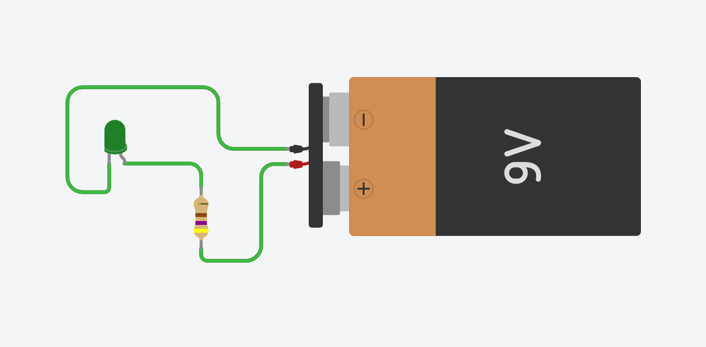

# 💡 Exercise 01.1: Basic LED Circuit / Circuit de bază cu LED

## EN
**Task:** Power an LED using a 9V battery and a 470Ω resistor to prevent it from burning out.

## RO
**Task:** Alimentează un LED folosind o baterie de 9V și un rezistor de 470Ω pentru a preveni arderea acestuia.

---

## 📸 Screenshot / Captură de ecran

## 🔗 Tinkercad Link
[View Project on Tinkercad](https://www.tinkercad.com/things/4fQGpErxJuH-01ledbasicex1)