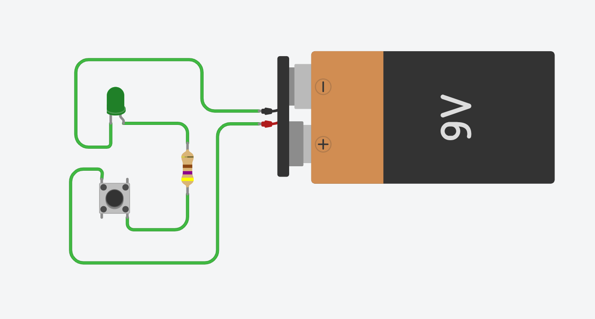

# 💡 Exercise 01.2: LED with Pushbutton / LED cu Buton

## EN
**Task:** Add a pushbutton to the basic LED circuit. The LED should only light up while the button is being pressed.

## RO
**Task:** Adaugă un buton (pushbutton) circuitului de bază cu LED. LED-ul trebuie să se aprindă doar în momentul în care butonul este apăsat.

---

## 📸 Screenshot / Captură de ecran

## 🔗 Tinkercad Link
[View Project on Tinkercad](https://www.tinkercad.com/things/fSXYwlIHgMu-01ledbasicex2)