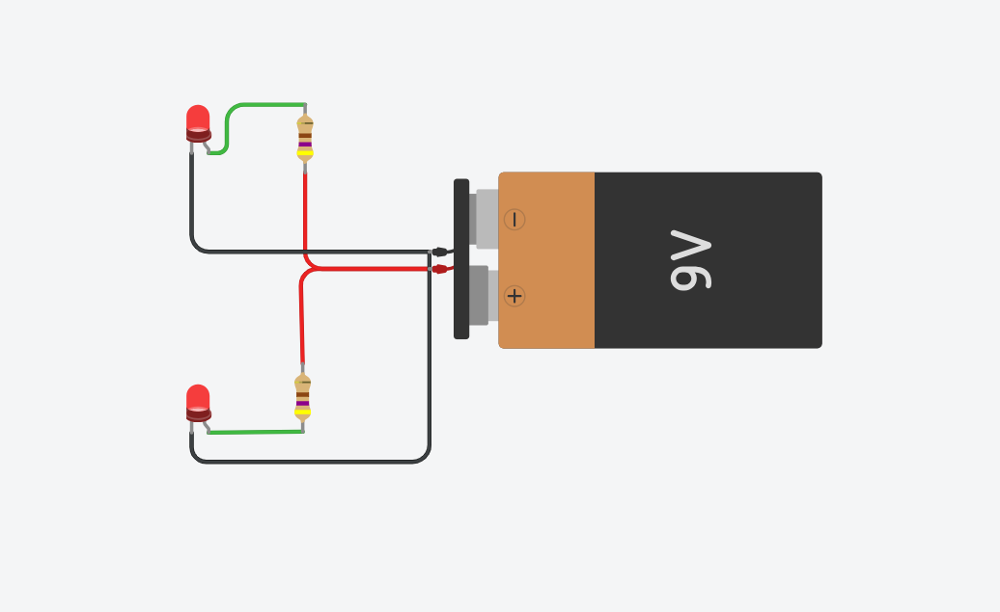

# 💡 Exercise 01.3: Two LEDs in Parallel / Două LED-uri în paralel

## EN
**Task:** Connect two LEDs to a single 9V battery so that both light up at the same time. Each LED must have its own 470Ω resistor.

## RO
**Task:** Conectează două LED-uri la o singură baterie de 9V astfel încât ambele să se aprindă în același timp. Fiecare LED trebuie să aibă propriul său rezistor de 470Ω.

---

## 📸 Screenshot / Captură de ecran

## 🔗 Tinkercad Link
[View Project on Tinkercad](https://www.tinkercad.com/things/0BPTRB7NuqQ-01ledbasicex3)