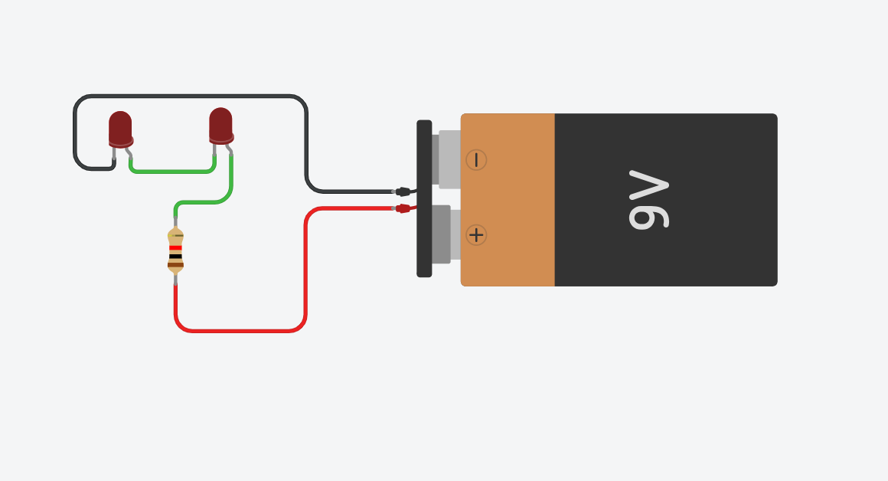

# 💡 Exercise 01.4: Two LEDs in Series / Două LED-uri în serie

## EN
**Task:** Connect two LEDs in series to a 9V battery using a single resistor.

## RO
**Task:** Conectează două LED-uri în serie la o baterie de 9V folosind un singur rezistor.

---

## 📸 Screenshot / Captură de ecran

## 🔗 Tinkercad Link
[View Project on Tinkercad](https://www.tinkercad.com/things/k9MxhumfF95-01ledbasicex4)