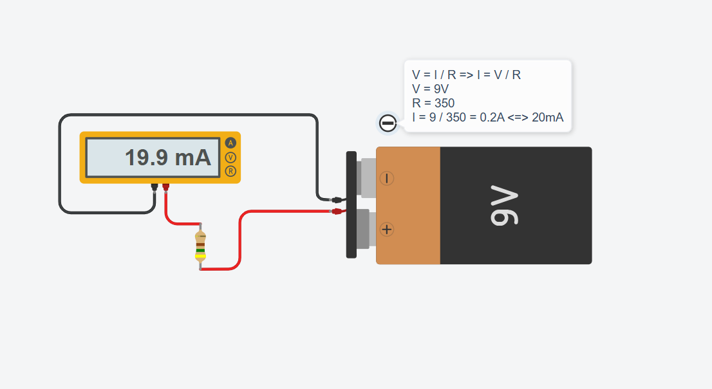

# 💡 Exercise 02.1: Simple Ohm's Law Verification / Verificarea Legii lui Ohm

## EN
**Task:** Create a circuit with 9V battery and a 450Ω resistor. Use a Multimeter to measure the current ($I$).

## RO
**Task:** Creează un circuit cu o baterie de 9V și un rezistor de 450Ω. Folosește un multimetru pentru a măsura curentul ($I$).

---

## 📸 Screenshot / Captură de ecran

## 🔗 Tinkercad Link
[View Project on Tinkercad](https://www.tinkercad.com/things/agL7kCvyB13-02ohmslawex1)