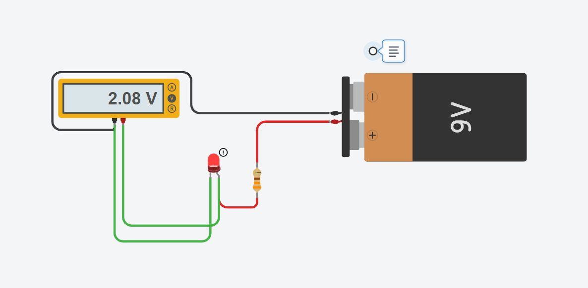
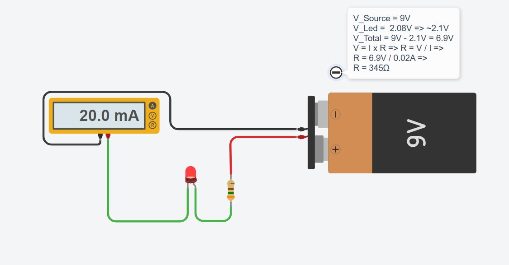

# 💡 Exercise 02.2: Simple Ohm's Law Verification / Verificarea Legii lui Ohm

## EN

**Task:** If you connect an LED directly to a 9V battery in Tinkercad, it will explode. You need to calculate the correct resistor so that exactly 20mA flows through a Red LED.

## RO

**Task:** Dacă pui un LED direct la o baterie de 9V în Tinkercad, acesta va exploda. Trebuie să calculezi rezistența corectă pentru ca prin LED-ul Roșu să treacă exact 20mA.

---

## 📸 Screenshot / Captură de ecran

## 🔗 Tinkercad Link

[View Project on Tinkercad](https://www.tinkercad.com/things/ki3nZLIswRb-02ohmslawex2)