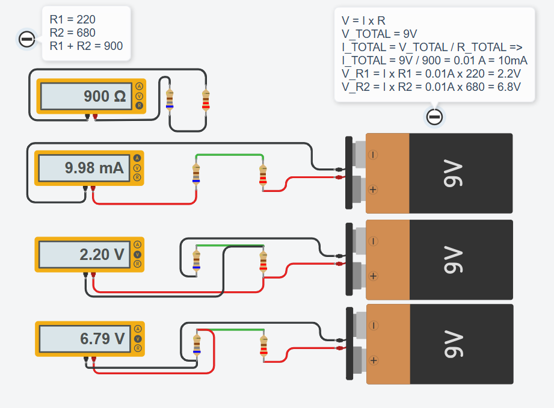

# 💡 Exercise 03.1: Resistors in Series / Rezistoare în Serie

## EN
**Task:** Create a circuit with a 9V battery and two resistors connected in series: **R1 = 220Ω** and **R2 = 680Ω**.
Use a Multimeter to:
1. Measure the total resistance ($R_{total}$) before connecting the battery.
2. Measure the total current ($I$) flowing through the circuit.
3. Measure the voltage drop across each resistor: $V_{R1}$ and $V_{R2}$.

## RO
**Task:** Creează un circuit cu o baterie de 9V și două rezistoare conectate în serie: **R1 = 220Ω** și **R2 = 680Ω**.
Folosește un multimetru pentru a:
1. Măsura rezistența totală ($R_{total}$) înainte de a conecta bateria.
2. Măsura curentul total ($I$) care trece prin circuit.
3. Măsura căderea de tensiune pe fiecare rezistor: $V_{R1}$ și $V_{R2}$.

---

## 📸 Screenshot / Captură de ecran

## 🔗 Tinkercad Link
[View Project on Tinkercad](https://www.tinkercad.com/things/5IQGrkT7ZNi-03seriesresistorsex1)