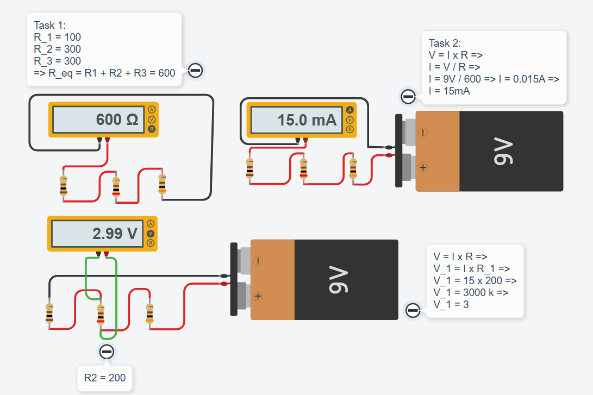

# 💡 Exercise 03.2: The Triple Series Challenge / Rezistoare în Serie

## EN
**Scenario:** Imagine a circuit powered by a **9V** battery. You have three resistors connected one after another (in series):
* $R_1 = 100 \ \Omega$
* $R_2 = 200 \ \Omega$
* $R_3 = 300 \ \Omega$

**Task:** Build the circuit and use a Multimeter to:
1. Calculate and measure the equivalent resistance ($R_{ext}$).
2. Find the total current ($I$) flowing through the circuit.
3. **Bonus:** How much voltage does $R_2$ "eat"?

## RO
**Scenariu:** Imaginează-ți un circuit alimentat de o baterie de **9V**. Ai trei rezistoare conectate unul după altul (în serie):
* $R_1 = 100 \ \Omega$
* $R_2 = 200 \ \Omega$
* $R_3 = 300 \ \Omega$

**Task:** Construiește circuitul și folosește un multimetru pentru a:
1. Calcula și măsura rezistența echivalentă ($R_{ext}$).
2. Afla curentul total ($I$) care trece prin circuit folosind Legea lui Ohm.
3. **Bonus:** Ce tensiune ($V$) "mănâncă" rezistorul $R_2$?

---

## 📸 Screenshot / Captură de ecran

## 🔗 Tinkercad Link
[View Project on Tinkercad](https://www.tinkercad.com/things/iqAH9sYmHGB-03seriesresistorsex2)