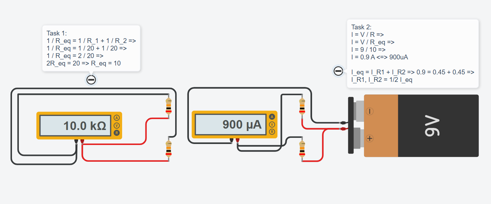
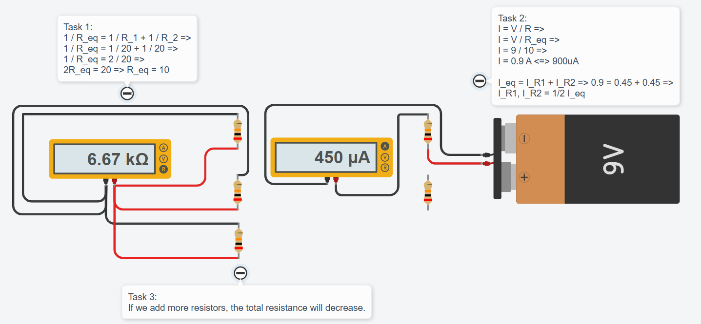

# 💡 Exercise 04.1: The Mirror Branches / Rezistoare în Paralel

## EN
**Scenario:** You have a **9V** battery and two identical "paths" for the current. Both resistors are **20kΩ** and are connected in parallel.

**Task:** Build the parallel setup and investigate:

1. Measure the total resistance (**R_total**).
2. Measure the total current (**I_total**). Then, measure the current through **R1 only (I_R1)**. Is it exactly half of the total?
3. What happens to the total resistance if you add a third **20kΩ** resistor in parallel?

---

## RO
**Scenariu:** Ai o baterie de **9V** și două „căi” identice pentru curent. Ambele rezistoare au **20kΩ** și sunt conectate în paralel.

**Task:** Construiește montajul în paralel și investighează:

1. Măsoară rezistența totală (**R_total**).
2. Măsoară curentul total (**I_total**). Apoi, măsoară curentul doar prin **R1 (I_R1)**.
3. Ce se întâmplă cu rezistența totală dacă mai adaugi un al treilea rezistor de **20kΩ** în paralel?

---

## 📸 Screenshot / Captură de ecran
  

---

## 🔗 Tinkercad Link
[View Project on Tinkercad](https://www.tinkercad.com/things/5F6QQEXxJL6-04parallelresistorsex1)