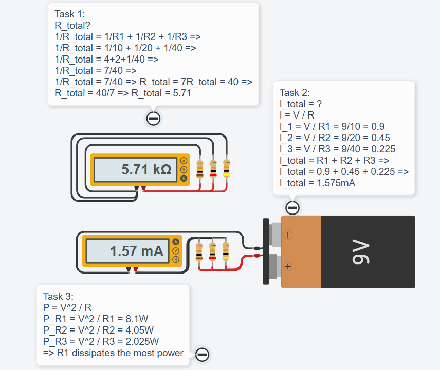
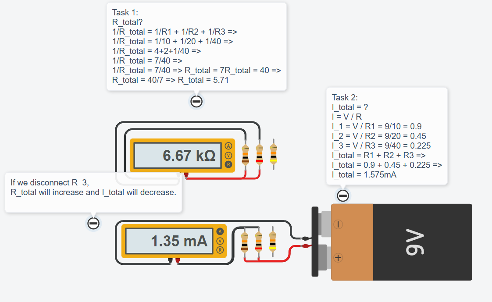

# 💡 Exercise 04.2: The Disappearing Branch / Ramura care Dispare

## EN
**Scenario:** You have a **9V battery** and three resistors connected in parallel:
- R1 = 10kΩ  
- R2 = 20kΩ  
- R3 = 40kΩ  

**Task:** Build the circuit in Tinkercad and investigate:

1. Measure the total resistance (R_total).
2. Measure the total current (I_total).
3. Measure the current through each resistor:
   - I_R1
   - I_R2
   - I_R3
4. Remove R3 from the circuit (disconnect it). What happens to:
   - R_total?
   - I_total?
5. Which resistor dissipates the most power?

---

## RO
**Scenariu:** Ai o baterie de **9V** și trei rezistoare conectate în paralel:
- R1 = 10kΩ  
- R2 = 20kΩ  
- R3 = 40kΩ  

**Task:** Construiește circuitul în Tinkercad și investighează:

1. Măsoară rezistența totală (R_total).
2. Măsoară curentul total (I_total).
3. Măsoară curentul prin fiecare rezistor:
   - I_R1
   - I_R2
   - I_R3
4. Scoate R3 din circuit (deconectează-l). Ce se întâmplă cu:
   - R_total?
   - I_total?
5. Care rezistor disipă cea mai mare putere?

---

## 📸 Screenshot / Captură de ecran

## 🔗 Tinkercad Link
[View Project on Tinkercad](https://www.tinkercad.com/things/6TfQdUwc1se-04parallelresistorsex2)